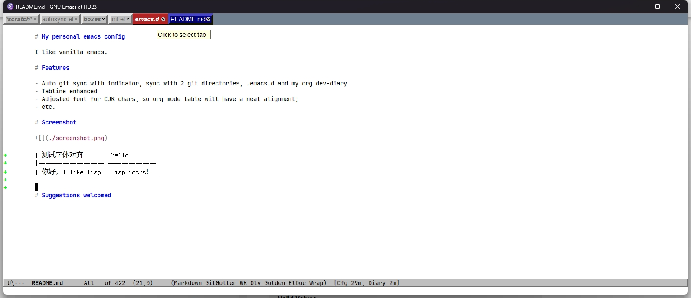

# My personal emacs config

I like vanilla emacs.

# Features

- Auto git sync with indicator, sync with 2 git directories, .emacs.d and my org dev-diary
- Tabline enhanced
- Adjusted font for CJK chars, so org mode table will have a neat alignment;
- etc.

# Screenshot

| 测试字体对齐      | hello        |
|-------------------|--------------|
| 你好，I like lisp | lisp rocks！ |

# Suggestions welcomed
